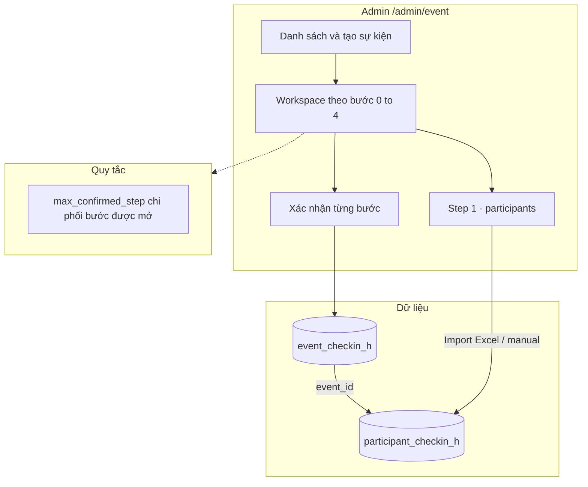
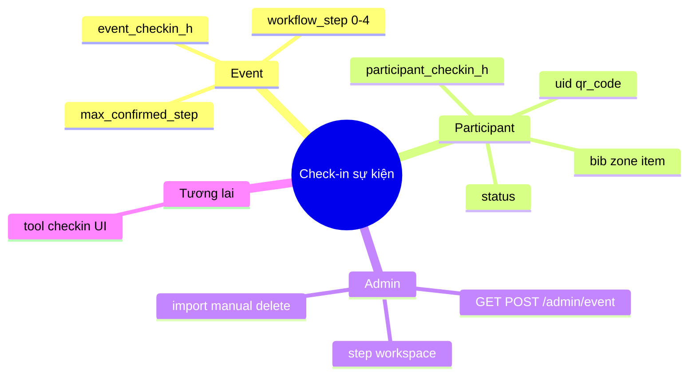
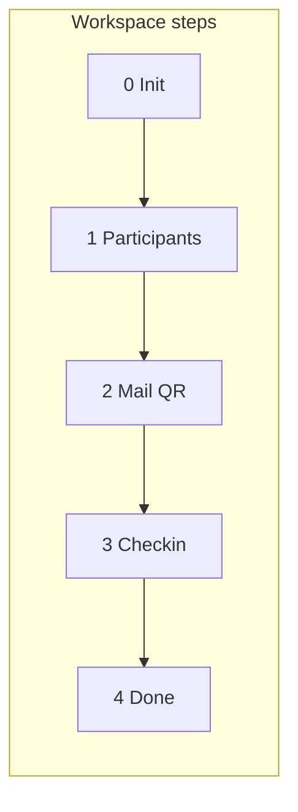
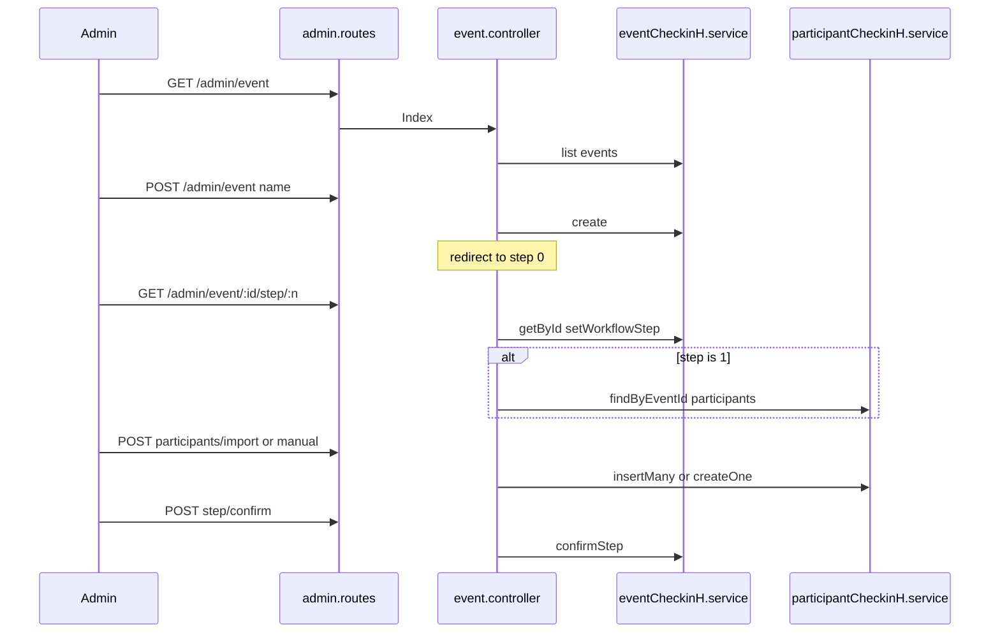
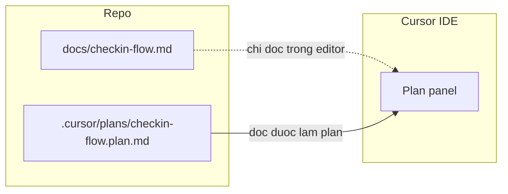

# Ghi chú flow check-in (tham khảo trực quan)

Tài liệu này tóm tắt **flow đang triển khai** trong codebase, dựa trên [src/model/EventCheckin_h.js](../src/model/EventCheckin_h.js), [src/model/ParticipantCheckin_h.js](../src/model/ParticipantCheckin_h.js), [src/areas/admin/controller/event.controller.js](../src/areas/admin/controller/event.controller.js) và [src/routes/admin.routes.js](../src/routes/admin.routes.js).

Phần **Plan — hiển thị trực quan** ngay bên dưới tương đương bản plan (tổng quan một màn hình); các mục 1–5 là chi tiết kỹ thuật.

---

## Plan — hiển thị trực quan (tổng quan)

### Sơ đồ “một nhìn” (luồng chính)



### Mindmap (phân nhánh ý)



### Bảng plan nhanh

| Khối | Việc chính |
| ---- | ---------- |
| Dữ liệu | Một `event_checkin_h`, nhiều `participant_checkin_h` qua `event_id`. |
| Workspace | 5 bước 0→4: khởi tạo → người tham dự → mail QR → check-in → kết thúc. |
| Điều hướng | Chỉ mở tới bước `max_confirmed_step + 1`; xác nhận lần lượt, không nhảy cóc. |
| Nhập liệu | Excel / form thủ công → `participant_checkin_h` (tối thiểu fullname + CCCD mỗi dòng). |
| Dữ liệu mở rộng | `bib`, `bib_name`, `category`, `item`, `zone`, `status`, `checkin_method`, `pickup_time_range`, v.v. — import gán `uid` + `qr_code` (mặc định trùng `uid`). |
| Tool công khai | View có sẵn; route `/tool-checkin` có thể gắn sau — luồng đầy đủ hiện ở admin. |

---

## 1. Hai collection chính

```mermaid
erDiagram
  event_checkin_h ||--o{ participant_checkin_h : "event_id"
  event_checkin_h {
    ObjectId _id PK
    string name
    number workflow_step "0-4 bước đang mở"
    number max_confirmed_step "-1..4 đã xác nhận xong"
    string slug short_id
  }
  participant_checkin_h {
    ObjectId _id PK
    ObjectId event_id FK
    string uid
    string qr_code
    string fullname
    string cccd
    string bib
    string bib_name
    string category
    string item
    string zone
    string status
    string checkin_method
    date checkin_time
  }
```

- **Một sự kiện** (`event_checkin_h`) có **nhiều người tham dự** (`participant_checkin_h`), liên kết qua `event_id`.

---

## 2. Workflow sự kiện (admin) — 5 bước 0 → 4

Định nghĩa trong [EventCheckin_h.js](../src/model/EventCheckin_h.js) (`WORKFLOW_STEPS`): **Khởi tạo → Quản lý người tham dự → Mail QR → Check-in → Kết thúc**.

| Bước | Ý nghĩa (tên trong code) |
| ---- | ------------------------ |
| 0 | INIT — khởi tạo / cấu hình sự kiện |
| 1 | ATHLETES — import Excel, thêm tay, xóa người tham dự |
| 2 | MAIL_QR — (bước dành cho gửi mail QR; UI có thể placeholder) |
| 3 | CHECKIN — ngày vận hành check-in |
| 4 | DONE — kết thúc |

**Quy tắc điều hướng** (trong `workspaceStep` / `confirmStep`):

- Chỉ xem được bước **tối đa** `max_confirmed_step + 1` (bước “đang làm”).
- **Xác nhận bước** (`POST .../step/confirm`) tăng `max_confirmed_step` lần lượt; không nhảy cóc.
- URL workspace: `/admin/event/:id/step/:step` với `step` ∈ `0..4`.



---

## 3. Luồng thao tác admin (HTTP)



**Route tham chiếu nhanh** ([admin.routes.js](../src/routes/admin.routes.js)):

- Danh sách / tạo sự kiện: `GET/POST /admin/event`
- Workspace: `GET /admin/event/:id` → redirect theo `workflow_step`; `GET /admin/event/:id/step/:step`
- Người tham dự: `POST .../participants/import`, `.../manual`, `.../participants/:participantId/delete`
- Xác nhận bước: `POST /admin/event/:id/step/confirm`
- Cập nhật meta sự kiện: `POST /admin/event/:id/update`
- Xóa sự kiện (kèm xóa participants): `POST /admin/event/:id/delete`

---

## 4. Dữ liệu người tham dự (BIB + chip)

Trên [ParticipantCheckin_h](../src/model/ParticipantCheckin_h.js): `event_id` (FK), `uid` (sinh khi import), `qr_code` (thường trùng `uid`), thông tin cá nhân, `zone`, `bib` / `bib_name` / `category` / `item`, `status`, `checkin_method`, `checkin_by` / `checkin_time`, `pickup_time_range` (chuỗi khung giờ nhận, vd `08:00 - 10:00`).

Import Excel map qua [participantCheckinExcelRow.util.js](../src/utils/participantCheckinExcelRow.util.js) (sheet đầu; cột tối thiểu `fullname` + `cccd`).

---

## 5. Phần “check-in công khai” (tool)

View như [src/views/tool/checkin.ejs](../src/views/tool/checkin.ejs) và `info.ejs` mô tả UI check-in (DataTables, `bib`, v.v.). Hiện không thấy route `/tool-checkin/...` được gắn trong [src/routes](../src/routes) — có thể là bước tích hợp sau hoặc mount ở chỗ khác. Luồng **đang hoàn chỉnh trong admin** là workspace + `participant_checkin_h`.

---

## 6. Ghi chú file tài liệu

File này là **bản plan / flow hiển thị trực quan** trong repo (Markdown + Mermaid). App không đọc file khi chạy; khi đổi code liên quan check-in, nên cập nhật lại mục **Plan — hiển thị trực quan** và các mục chi tiết cho khớp.

### Cursor Plan vs `docs/checkin-flow.md`

- **File trong `docs/`** chỉ là Markdown trong repo (preview, GitHub, IDE). **Không** tự đồng bộ với panel **Plan** của Cursor.
- **Plan trong Cursor** là artifact riêng (thường mở từ Plan mode / danh sách plan). Để có cùng nội dung flow trong panel Plan, dùng file plan trong repo: [.cursor/plans/checkin-flow.plan.md](../.cursor/plans/checkin-flow.plan.md) (bản tóm tắt + liên kết tới tài liệu đầy đủ ở đây), hoặc tạo plan mới trong Cursor và dán phần tóm tắt từ mục **Plan — hiển thị trực quan** ở trên.



- **Gợi ý**: coi `docs/checkin-flow.md` là **nguồn đầy đủ** (git); `.cursor/plans/checkin-flow.plan.md` là **bản rút gọn** để mở nhanh trong Cursor Plan; khi đổi flow, cập nhật cả hai cho đồng bộ.
