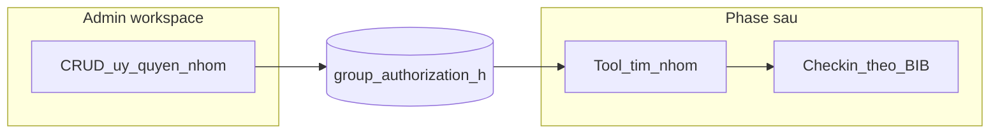

# Plan: Ủy quyền nhóm (Group authorization)

Tài liệu thiết kế và **trạng thái triển khai** trong codebase. Mockup: tab **Uỷ quyền nhóm**, đại diện + nhiều BIB.

## Đã triển khai (admin + tool đọc token)

- Model [`src/model/GroupAuthorization_h.js`](../src/model/GroupAuthorization_h.js), trường trên [`ParticipantCheckin_h`](../src/model/ParticipantCheckin_h.js): `group_authorization_id`, `checkin_via_group_id`.
- Service [`src/areas/admin/services/groupAuthorizationH.service.js`](../src/areas/admin/services/groupAuthorizationH.service.js): CRUD, parse danh sách BIB, xóa nhóm khi xóa sự kiện / import reset.
- Admin: bước **2 — tab Uỷ quyền nhóm** ([`_step_group_auth.ejs`](../src/views/admin/event/_step_group_auth.ejs)), route `POST /admin/event/:id/group-authorizations` (+ update/delete).
- Tool: `GET /tool-checkin/group-auth/:token` (cùng sự kiện với tài khoản check-in), view [`tool/group_auth.ejs`](../src/views/tool/group_auth.ejs).

**Chưa làm (có thể làm sau):** ghi `checkin_via_group_id` lúc check-in hộ; bulk check-in theo nhóm trong tool.

## Mục tiêu nghiệp vụ

- Một **người đại diện** (có thể không phải VĐV trong danh sách) được gắn với **nhiều BIB / participant** trong cùng sự kiện.
- Dùng cho trường hợp: VĐV không đến nhưng nhờ người khác nhận đồ / check-in hộ, hoặc nhóm nhờ một người làm thủ tục.
- (Tùy chọn sau) **Link / QR** để xác minh giấy ủy quyền — URL chỉ chứa token không đoán được, không lộ PII trong path.

## Đề xuất schema

### Collection `group_authorization_h` (tên có thể đổi)

| Trường | Mô tả |
|--------|--------|
| `event_id` | ObjectId → `event_checkin_h`, index |
| `representative` | `{ fullname, email, phone, cccd }` (chuẩn hóa trim) |
| `participant_ids` | Mảng ObjectId → `participant_checkin_h` cùng `event_id` |
| `token` | Chuỗi ngẫu nhiên (optional) cho URL công khai / QR |
| timestamps | `createdAt`, `updatedAt` |

### Bổ sung trên `participant_checkin_h` (khi triển khai)

- `group_authorization_id` (ObjectId, ref, optional, sparse index): VĐV thuộc nhóm nào — **hoặc** chỉ tra ngược từ `participant_ids` trong bảng nhóm (chọn một hướng để tránh duplicate nguồn sự thật).

### Ràng buộc

- Một VĐV thuộc **tối đa một** nhóm ủy quyền (unique sparse trên participant nếu dùng FK).
- Không gán cùng một BIB vào hai nhóm; validate trùng `event_id` + BIB khi tạo/sửa.

## Luồng (mermaid)

- **Admin**: tab CRUD danh sách đại diện + danh sách BIB; cột Link/QR nếu bật token.
- **Tool `/tool-checkin`**: tìm theo CCCD đại diện / quét mã nhóm → hiển thị VĐV trong nhóm → check-in **từng người** hoặc **bulk** (cần chốt UX và quyền TNV).

## Ghi nhận khi check-in hộ

- Giữ `checkin_by` (email TNV) như hiện tại.
- Có thể thêm sau: `checkin_via_group_id` hoặc `checkin_note` trên participant để audit “đại diện X / nhóm Y”.

## Rủi ro

- **Duplicate BIB** trong sự kiện: logic import hiện có phải nhất quán với gán nhóm.
- **Nhóm lớn (40+ BIB)**: bulk update cần batch hoặc transaction.
- **Bảo mật**: token đủ entropy; rate-limit URL công khai nếu có.

## Tham chiếu code hiện tại

- Participant: [src/model/ParticipantCheckin_h.js](../src/model/ParticipantCheckin_h.js)
- Tool stats / list: [src/controller/toolCheckin.controller.js](../src/controller/toolCheckin.controller.js)
